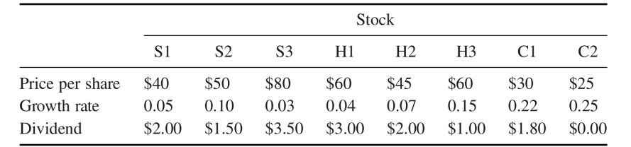

```{r setup, include=FALSE}
knitr::opts_chunk$set(echo = TRUE)
```
## INTEGER PROGRAMMING

Consider the following activity-on-arc project network, where the 12 arcs (arrows) represent the 12 activities (tasks) that must be performed to complete the project and the network displays the order in which the activities need to be performed. The number next to each arc (arrow) is the time required for the corresponding activity. Consider the problem of finding the longest path (the largest total time) through this network from start (node 1) to finish (node 9), since the longest path is the critical path.  
 
 


## QUESTION 1:
Formulate and solve the binary integer programming (BIP) model for this problem using library lpsolve or equivalent in R.


## Mathematical Formulation:


Let xij represents the arc from node i to node j

where 

      i = 1,2,3,4,5,6,7,8

      j = 2,3,4,5,6,7,8,9  
      

**Max** = 5x12 + 3x13 + 3x35 + 4x24 + 2x25 + 4x47 + x46 + 2x58 + 6x57 + 5x69 + 4x79 + 7x89 ;


S.T)

**Starting Node**:

                x13 + x12 = 1;


**Intermediate Node**:

    x12 - x25 - x24 = 0;
    x13 - x35 = 0;
    x25 + x35 - x57 - x58 = 0;
    x24 - x46 - x47 = 0;
    x58 - x89 = 0;
    x46 - x69 = 0;
    x57 + x47 - x79 = 0;


**End Node:**

          x69 + x79 + x89 = 1;

**Binary and Non Negativity Constraints**:
 
         bin xij,  xij>=0;

\newpage

**LP File**

 
 
 
## Problem Solution using R

```{r}
library(lpSolveAPI)

arcs<- read.lp("Arcs.lp")

solve(arcs)

#Print the model

arcs

```
```{r}
#To identify the Optimal Solution
get.objective(arcs)
```
The optimal solution of the problem is 17.

```{r}
#To Identify the variables
Values <-get.variables(arcs)

# Assigning Rownames to the values
Nodes_names <- c("x12","x13","x35","x24","x25","x47","x46","x58","x57","x69","x79","x89")
as.data.frame(cbind(Nodes_names,Values))

# To display the constraint values
get.constraints(arcs)
```

### OBSERVATIONS:

#### The critical Path is (which is the longest path):


From Node 1 to 2

From Node 2 to 5

From Node 5 to 7

From Node 7 to 9

**The time required for the corresponding activity is : 17**

\newpage

## QUESTION 2:

Selecting an Investment Portfolio An investment manager wants to determine an optimal portfolio for a wealthy client. The fund has $2.5 million to invest, and its objective is to maximize total dollar return from both growth and dividends over the course of the coming year. The client has researched eight high-tech companies and wants the portfolio to consist of shares in these firms only. Three of the firms (S1 – S3) are primarily software companies, three (H1–H3) are primarily hardware companies, and two (C1–C2) are internet consulting companies. The client has stipulated that no more than 40 percent of the investment be allocated to any one of these three sectors. To assure diversification, at least $100,000 must be invested in each of the eight stocks. Moreover, the number of shares invested in any stock must be a multiple of 1000. 

The table below gives estimates from the investment company’s database relating to these stocks. These estimates include the price per share, the projected annual growth rate in the share price, and the anticipated annual dividend payment per share. 



### Determine the maximum return on the portfolio. What is the optimal number of shares to buy for each of the stocks? What is the corresponding dollar amount invested in each stock?

**Mathematical Formulation:**

Let S1,S2,S3,H1,H2,H3,C1,C2 be the no. of shares for each stock(firms) 

As, it is mentioned that the number of shares invested in any stock must be a multiple of 1000. So, lets define each stock has 1000 shares.


**Maximize** : 4000S1+ 6500S2+ 5900S3+5400H1+ 5150H2+ 10000H3+ 8400C1+ 6250C2;

S.T)

**The fund has $2.5 million to invest**

Invest_Fund: 40(1000*S1)+ 50(1000*S2)+ 80(1000*S3)+ 60(1000*H1)+ 45(1000*H2)+ 60(1000*H3)+ 30(1000*C1)+ 25(1000*C2) <= 2500000;

                 40S1 + 50S2 + 80S3 + 60H1 + 45H2 + 60H3 + 30C1 + 25C2 <= 2500

\newpage

**The client has stipulated that no more than 40 percent of the investment be allocated to any one of these three sectors**

S Firms: 40S1+ 50S2+ 80S3 <= 1000;

H Firms: 60H1+ 45H2+ 60H3 <= 1000;

C Firms: 30C1+ 25C2 <= 1000;

**To assure diversification, at least $100,000 must be invested in each of the eight stocks.**

S1: 40S1>=100;

S2: 50S2>=100;

S3: 80S3>=100;

H1: 60H1>=100;

H2: 45H2>=100;

H3: 60H3>=100;

C1: 30C1>=100;

C2: 25C2>=100;

### Solution using R


**LP File of the problem without integer restriction**

 
 
**Solution of LP Model without using integer restriction**
```{r}

library(lpSolveAPI)

stock<- read.lp("Stock.lp")

solve(stock)

#Print the model

stock

#To identify the Optimal Solution
get.objective(stock)
values <-get.variables(stock)
stocknames<-c("S1","S2","S3","H1","H2","H3","C1","C2")
d<-as.data.frame(cbind(stocknames,values*1000))
colnames(d)<- c("Stocknames","No. Of Shares")
d

get.constraints(stock)

```
\newpage
**OBSERVATIONS:**

* The Maximum return on the Portfolio is : 487152.8


 


**LP File of the problem with integer restriction**

 
 

**Solution of LP Model with integer restriction**
```{r}
#Solution of LP Model with using integer restriction
library(lpSolveAPI)

Stock_int<- read.lp("Stock_int.lp")

solve(Stock_int)

#Print the model

Stock_int

#To identify the Optimal Solution
get.objective(Stock_int)
Vars<-get.variables(Stock_int)
stocknames<-c("S1","S2","S3","H1","H2","H3","C1","C2")
V<-as.data.frame(cbind(stocknames,Vars*1000))
colnames(V)<- c("Stocknames","No. Of Shares")
V
get.constraints(Stock_int)

```
\newpage

**OBSERVATIONS**

* The Maximum return on the Portfolio is : 477400

 
 
 All the constraints have been satisfied with the integer programming.
 
 
 
 \newpage
 
### Compare the solution in which there is no integer restriction on the number of shares invested. By how much (in percentage terms) do the integer restrictions alter the value of the optimal objective function? By how much (in percentage terms) do they alter the optimal investment quantities?

**a) By how much (in percentage terms) do the integer restrictions alter the value of the optimal objective function?**


 
 

**b) By how much (in percentage terms) do they alter the optimal investment quantities?**


 
 
 
  

