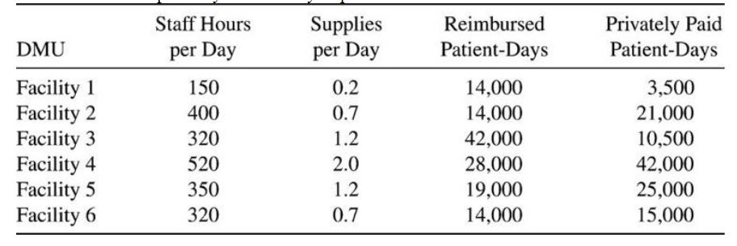
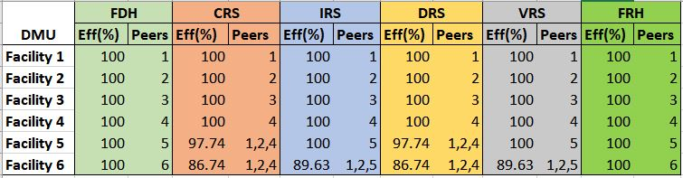
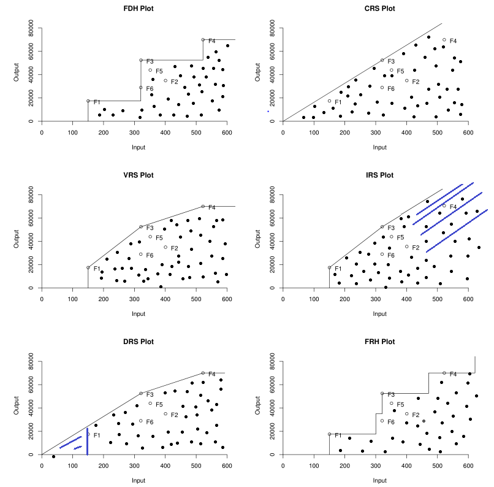
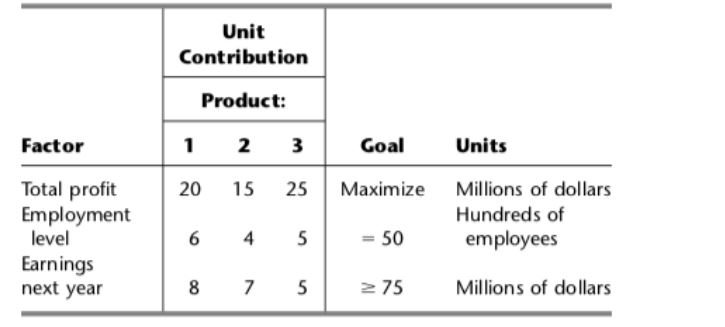

```{r setup, include=FALSE}
knitr::opts_chunk$set(echo = TRUE)
```

# DEA Module

1. The Hope Valley Health Care Association owns and operates six nursing homes in adjoining states. An evaluation of their efficiency has been undertaken using two inputs and two outputs. The inputs are staffing labor (measured in average hours per day) and the cost of supplies (in thousands of dollars per day). The outputs are the number of patient-days reimbursed by third-party sources and the number of patient-days reimbursed privately. A summary of performance data is shown in the table below. 
 


## QUESTIONS:

**1) Formulate and perform DEA analysis under all DEA assumptions of FDH, CRS, VRS, IRS, DRS, and FRH.**

**2) Determine the Peers and Lambdas under each of the above assumptions.**

## SOLUTION:

```{r message=FALSE}
#Loading the required libraries
#install.packages("Benchmarking")
library(Benchmarking)
library(cowplot)
```

\newpage

# Compute the Formulation

As there are Many DMUs we would be using benchmarking Libraries for DEA.

Now, We will read the data as input and output as vectors.Our problem has facilities as 6 DMUs.

* INPUT  :  staff hours and supplies per day.

* OUTPUT : Reimbursed Patient-Days and Privately paid patient days.

```{r}
input<- matrix(c(150,400,320,520,350,320,0.2,0.7,1.2,2.0,1.2,0.7),ncol = 2)
Output<- matrix(c(14000,14000,42000,28000,19000,14000,3500,21000,10500,42000,25000,15000),ncol=2)
colnames(input)<-c('staff Hours(Per Day)','Supplies(Per Day)')
colnames(Output)<-c('Reimbursed Patient','Privately Paid Patient')
rownames(input)<- c('Facility1','Facility2','Facility3','Facility4','Facility5','Facility6')
rownames(Output)<- c('Facility1','Facility2','Facility3','Facility4','Facility5','Facility6')
input
Output
```

**We now perform the DEA analysis.**

# DEA analysis using FDH

Now, we are going to formulate and compute the DEA  analysis using FDH.

 The free disposability assumption stipulates that we can freely discard unnecessary inputs and unwanted outputs

```{r}
#Provide the input and output
Analysis_fdh <- dea(input,Output,RTS = "fdh")

# Efficiency of the DEA with FDH Assumption
Efficiency_fdh <- as.data.frame(Analysis_fdh$eff)
colnames(Efficiency_fdh) <- c("Efficiency_FDH")

# Identify the peers
peers_fdh <- as.data.frame(Analysis_fdh$peers)
colnames(peers_fdh) <- c("Peers_FDH")

# Identify the relative weights using Lambda Function
lambda_fdh <- as.data.frame(Analysis_fdh$lambda)
colnames(lambda_fdh) <- c("FDH_Lambda1","FDH_Lambda2","FDH_Lambda3","FDH_Lambda4","FDH_Lambda5","FDH_Lambda6")

#Create a tabular data with peers, lambda and efficiency 
dea_fdh <- cbind(Efficiency_fdh,peers_fdh,lambda_fdh)
rownames(dea_fdh)<- c('F1','F2','F3','F4','F5','F6')

#Show the summary of the table
dea_fdh

```


As we are familiar that peers are the way we could identify the inefficient DMUs and Lambda values are the relative weights assigned from the peer units when solving DEA model.

**Observations from FDH:**

The above summary table of DEA Analysis using FDH represents that every facility is working to the fullest and with full efficiency. Each peer is assigned to a unit which implies Lambda = 1 and Efficiency =1.

# DEA analysis using CRS

Now, we are going to formulate and compute the DEA  analysis using CRS

Constant returns to scale (CRS) is one of the scaling assumptions. This assumption stipulates that if any possible production combination can arbitrarily be scaled up or down.

```{r}
#Provide the input and output 
Analysis_CRS <- dea(input,Output,RTS = "crs")

# Efficiency of the DEA with CRS Assumption
Efficiency_CRS <- as.data.frame(Analysis_CRS$eff)
colnames(Efficiency_CRS) <- c("Efficiency_CRS")

# Identify the peers
peers_CRS <- peers(Analysis_CRS)
colnames(peers_CRS) <- c("Peer1_CRS","Peer2_CRS","Peer3_CRS")

# Identify the relative weights using Lambda Function
lambda_CRS <- lambda(Analysis_CRS)
colnames(lambda_CRS) <- c("CRS_Lambda1","CRS_Lambda2","CRS_Lambda3","CRS_Lambda4")

dea_CRS <- cbind(Efficiency_CRS,peers_CRS,lambda_CRS)

rownames(dea_CRS)<- c('F1','F2','F3','F4','F5','F6')

# Summary of the table
dea_CRS

```
**Observations from CRS:**

When we examine the above summary table of CRS assumption, 
it is clearly evident from the peers and lambda values that the facilities 1,2,3 and 4 are using 100% efficiency. 
Whereas facilities 5 and 6, need parts of 1,2 and 4 as peers and its corresponding lambdas shown above in the table, which implies that these 2 facilities have to improve its efficiency as they are 97.74% and 86.74% respectively.

# DEA analysis using VRS

Now, we are going to formulate and compute the DEA  analysis using VRS.

VRS is one of the scaling assumptions. This Assumptions represents that variable return to scale
```{r}

Analysis_VRS <- dea(input,Output,RTS = "vrs")

# Efficiency of the DEA with FDH Assumption
Efficiency_VRS <- as.data.frame(Analysis_VRS$eff)
colnames(Efficiency_VRS) <- c("Efficiency_VRS")

# Identify the peers
peers_VRS <- peers(Analysis_VRS)
colnames(peers_VRS) <- c("Peer1_VRS","Peer2_VRS","Peer3_VRS")

# Identify the relative weights using Lambda Function
lambda_VRS <- lambda(Analysis_VRS)
colnames(lambda_VRS) <- c("VRS_Lambda1","VRS_Lambda2","VRS_Lambda3","VRS_Lambda4","VRS_Lambda5")

dea_VRS <- cbind(Efficiency_VRS,peers_VRS,lambda_VRS)

rownames(dea_VRS)<- c('F1','F2','F3','F4','F5','F6')

#Summary table 
dea_VRS

```
**Observations from VRS:**

When we observe the above summary tables of DEA analysis using VRS assumption, 
it indicates that facilities 1,2,3,4 and 5 are fully efficient whereas facility 6 has its efficiency of 89.63% and need to use the parts of facilities 1,2 and 5 as peers.

# DEA analysis with IRS

Now, we are going to formulate and compute the DEA  analysis using IRS.

IRS is one of the scaling assumptions It represents that for possible production process we can arbitrarily increase the scale of the operation.

```{r}
Analysis_IRS <- dea(input,Output,RTS = "irs")

# Efficiency of the DEA with FDH Assumption
Efficiency_IRS <- as.data.frame(Analysis_IRS$eff)
colnames(Efficiency_IRS) <- c("Efficiency_IRS")

# Identify the peers
peers_IRS <- peers(Analysis_IRS)
colnames(peers_IRS) <- c("Peer1_IRS","Peer2_IRS","Peer3_IRS")

# Identify the relative weights using Lambda Function
lambda_IRS <- lambda(Analysis_IRS)
colnames(lambda_IRS) <- c("IRS_Lambda1","IRS_Lambda2","IRS_Lambda3","IRS_Lambda4","IRS_Lambda5")

dea_IRS <- cbind(Efficiency_IRS,peers_IRS,lambda_IRS)

rownames(dea_IRS)<- c('F1','F2','F3','F4','F5','F6')

#Summary table
dea_IRS
```

**Observations from IRS:**

This DEA Analysis of IRS performs same as VRS by utilizing the facilities 1,2,3,4 and 5 to its fullest ie, efficiency of 100% whereas the facility 6 needs to improve its efficiency, which is 89.63% while parts of facilities 1,2 and 5 serving as the peers.

# DEA analysis with DRS

Now, we are going to formulate and compute the DEA  analysis using DRS.

DRS is one of the scaling assumptions It represents that for possible production process we can arbitrarily decrease the scale of the operation.
```{r}
Analysis_DRS <- dea(input,Output,RTS = "drs")

# Efficiency of the DEA with FDH Assumption
Efficiency_DRS <- as.data.frame(Analysis_DRS$eff)
colnames(Efficiency_DRS) <- c("Efficiency_DRS")

# Identify the peers
peers_DRS <- peers(Analysis_DRS)
colnames(peers_DRS) <- c("Peer1_DRS","Peer2_DRS","Peer3_DRS")

# Identify the relative weights using Lambda Function
lambda_DRS <- lambda(Analysis_DRS)
colnames(lambda_DRS) <- c("DRS_Lambda1","DRS_Lambda2","DRS_Lambda3","DRS_Lambda4")

dea_DRS <- cbind(Efficiency_DRS,peers_DRS,lambda_DRS)

rownames(dea_DRS)<- c('F1','F2','F3','F4','F5','F6')


#Summary table

dea_DRS
```

**Observations from DRS:**

DRS Summary table indicates that facilities 1,2,3 and 4 has 100% efficiency. But facilities 4 and 5 has efficiency of 97.74% and 86.74% respectively. Both of them needs facilities 1,2 and 4 as their peers


# DEA analysis with FRH

Now, we are going to formulate and compute the DEA  analysis using add.

FRH is a free disposability and replicability hull assumption. It indicates the Additivity (scaling up and down, but only with integers) and free disposability.
```{r}

Analysis_FRH <- dea(input,Output,RTS = "add")

# Efficiency of the DEA with FDH Assumption
Efficiency_FRH <- as.data.frame(Analysis_FRH$eff)
colnames(Efficiency_FRH) <- c("Efficiency_FRH")

# Identify the peers
peers_FRH <- peers(Analysis_FRH)
colnames(peers_FRH) <- c("Peer1_FRH")

# Identify the relative weights using Lambda Function
lambda_FRH <- lambda(Analysis_FRH)
colnames(lambda_FRH) <- c("FRH_Lambda1","FRH_Lambda2","FRH_Lambda3","FRH_Lambda4","FRH_Lambda5","FRH_Lambda6")

dea_FRH <- cbind(Efficiency_FRH,peers_FRH,lambda_FRH)

rownames(dea_FRH)<- c('F1','F2','F3','F4','F5','F6')
#Summary table
dea_FRH
```

**Observations from FRH:**

The summary table of FRH indicates that the efficiency of all the 6 facilities is 100%, with their own peers and lambda values of 1, which is same as FDH assumption.


## 3) Summarize your results in a tabular format 




The above table represents that 6 facilities(DMUs) with their corresponding efficiency and peers for all the assumptions.

## 4) Compare and Contrast the above results 


**RESULTS FROM SUMMARY TABLE:**

Considering,

* FDH and FRH assumptions : All the 6 facilities are 100% efficient. Each facility has their own Peers in both of these assumptions.

* CRS and DRS Assumptions : Facilities 1,2,3 and 4 are 100 % efficient while the efficiency of facilities 5 and 6 is 97.74% and 86.74%  respectively                             and need to use the parts of facilities 1,2 and 4 as their peers.

* VRS and IRS Assumptions : Facilities 1,2,3,4 and 5 are 100 % efficient whereas the 6th facility being inefficient(89.63%) and need to use the                                 parts of facilities 1,2 and 5 as their peers. 


## Comparision of the different assumptions graphically


```{r eval=FALSE}

dea.plot(input,Output,RTS="fdh",ORIENTATION="in-out",txt=rownames(dea_fdh),xlab='Input',ylab='Output',main="FDH Plot")  
dea.plot(input,Output,RTS="crs",ORIENTATION="in-out",txt=rownames(dea_CRS),xlab='Input',ylab='Output',main="CRS Plot")
dea.plot(input,Output,RTS="vrs",ORIENTATION="in-out",txt=rownames(dea_VRS),xlab='Input',ylab='Output',main="VRS Plot")
dea.plot(input,Output,RTS="irs",ORIENTATION="in-out",txt=rownames(dea_IRS),xlab='Input',ylab='Output',main="IRS Plot")
dea.plot(input,Output,RTS="drs",ORIENTATION="in-out",txt=rownames(dea_DRS),xlab='Input',ylab='Output',main="DRS Plot")
dea.plot(input,Output,RTS="add",ORIENTATION="in-out",txt=rownames(dea_FRH),xlab='Input',ylab='Output',main="FRH Plot")

```



The above graphs explains the DEA technology sets under different assumptions

\newpage


**The main idea behind the DEA Analysis is :**

* DEA approach involves looking for the smallest set that includes or envelopes the input–output observations for all of the firms. This also         explains the name: **Data Envelopment Analysis**

* The larger the sets, the larger the estimated technology, i.e. the more optimistic we are in estimating the improvement potential of a firm. 
  The flip-side of this is of course that the firms look less efficient in the larger models.
  
**OBSERVATIONS  FROM THE GRAPHS:**


* We can see that FDH is the smaller technology set.As we know that FDH means that inputs and outputs can freely be disposed off (or) we can always produce fewer outputs with more inputs. Even though its efficiency is 100% , it has its own drawbacks during theoretical or empirical reference of technology. If the data set is sufficiently large, then free disposability is also sufficiently powerful to create enough relevant comparisons.

* VRS is larger set than FDH  because it fills out spaces that FHD reduced. Here we can see that Facility 6 is inefficient.

* Considering IRA and DRS, it is clearly evident that DRS and IRS  are larger than VRS.

  1. As we can see that, when input is low,DRS tries to increase the technology set
  2. In contrary, IRS tries to increase the technology for large input values.
  3. DRS analysis indicates that 5 and 6 facilities can enhance their efficiency and IRS  shows that facility 6 may improve as well.

* Among all, CRS is largest technology set irrespective of convexity assumptions,which allows  us to see if there is any possible combination to scale up or down. Based on the efficiency levels, facilities 5 and 6 should be improved.

* Regarding FRH, it is larger than FDH and smaller than CRS and its efficiency is same as FDH

* As we saw that in the main idea of the DEA analysis that the firms look less efficient in the larger models and it is quite true if examine the graph.

\newpage

# GOAL PROGRAMMING

The Research and Development Division of the Emax Corporation has developed three 
new products. A decision now needs to be made on which mix of these products should 
be produced. Management wants primary consideration given to three factors: total 
profit, stability in the workforce, and achieving an increase in the company’s earnings 
next year from the $75 million achieved this year. In particular, using the units given in 
the following table, they want to 
 
Maximize Z = P - 6C - 3D, where  
 
P = total (discounted) profit over the life of the new products, 
C = change (in either direction) in the current level of employment, 
D = decrease (if any) in next year’s earnings from the current year’s level. 
 
The amount of any increase in earnings does not enter into Z, because management is concerned 
primarily with just achieving some increase to keep the stockholders happy. (It has mixed 
feelings about a large increase that then would be difficult to surpass in subsequent years.) 
 
The impact of each of the new products (per unit rate of production) on each of these factors is 
shown in the following table: 



\newpage
# QUESTIONS:

## 1) Define y1+ and y1-, respectively, as the amount over (if any) and the amount under (if any) the employment level goal. Define y2+ and y2- in the same way for the goal regarding earnings next year. Define x1, x2, and x3 as the production rates of Products 1, 2, and 3, respectively. With these definitions, use the goal programming technique to express y1+, y1- , y2+ and y2-  algebraically in terms of x1, x2, and x3. Also express P in terms of x1, x2, and x3. 

Let Xi be the production rate of Product 1,2,3

* x1 = Production rate of Product1

* x2 = Production rate of Product2

* x3 = Production rate of Product3

Let us define auxiliary variables as :

* y1+  and y1-, represents  the amount over  and amount under the employment level goal respectively.

* y2+ and y2- , represents the amount over  and amount under the earnings goal over next year respectively.

## 2) Express management’s objective function in terms of x1, x2, x3, y1+, y1- , y2+ and y2-. 

**Maximize** Z: P – 6C – 3D

              Z = 20x1 + 15 x2 + 25 x3 - 6 y1+ - 6y2+ - 3y2-
S.T)

**Employment Level** : 

                  6x1 + 4x2 + 5x3 -( y1+ - y1-) = 50
                
**Earnings Level**: 

                  8x1 + 7x2 + 5x3 -(y2+ - y2-) = 75
                  
**Non Negativity constraints** :

                  xi >= 0 ;  i=1,2,3
                  yi+>= 0;  i=1,2
                  yi->= 0;  i=1,2
\newpage

## 3) Formulate and solve the linear programming model. What are your findings? 
```{r}

library(lpSolveAPI)

goal<- read.lp("Goal.lp")

solve(goal)

#Print the model

goal

```
```{r}
#To identify the Optimal Solution
get.objective(goal)
```

The Optimal Value for the model is 225

```{r}
#To Identify the variables
get.variables(goal)

```
**Analyzing the results:**

In our case the values for the variables are as follows:
x1 = 0; x2 = 0; x3 = 15;
y1+ = 25, y1- = 0 , y2- = 0


Our Objective Function:  20x1 + 15 x2 + 25 x3 - 6 y1+ - 6y2+ - 3y2-

                      : 25x15(Total profit) - 6x25(Workforce Penalty) = 225

We can maximize the profit by making production rate of product3 = 15, getting profits to (25X15=375) while we need  to hire 25 more employees which will result in a penalty of (25X6 = 150). Hence our objective function would be 225( **Which is practically infeasible solution**)

which Implies that y2(Earnings) goal is fully satisfied. Whereas the Employment goal is projected to be exceeded by 25 and based on the total profit of Product 3 which has negative result on its profit by 150.

## Prioritizing the Goals using Streamlined approach

Now Let us consider the workforce stability(Employment) and Earnings goals as a higher priority than the total profit over the life:

In streamlined Approach, we know that 
* (1). The different penalty weights are assigned within each of the two priority levels

* (2) the individual penalty weights for the first-priority goals have been multiplied by M.

These penalty weights yield the following single linear programming model that incorporates all the goal

## PREEMPTIVE GOAL PROGRAMMING FORMULATION:

Let Xi be the production rate of Product 1,2,3

* x1 = Production rate of Product1

* x2 = Production rate of Product2

* x3 = Production rate of Product3

Let us define auxiliary variables as :

* y1+  and y1-, represents  the amount over  and amount under the employment level goal respectively.

* y2+ and y2- , represents the amount over  and amount under the earnings goal over next year respectively.


**Maximize** Z: P – 6C – 3D

              Z = 20x1 + 15 x2 + 25 x3 - 6My1+ - 6My2+ - 3My2-
S.T)

**Employment Level** : 

                  6x1 + 4x2 + 5x3 -( y1+ - y1-) = 50
                
**Earnings Level**: 

                  8x1 + 7x2 + 5x3 -(y2+ - y2-) = 75
                  
**Non Negativity constraints** :

                  xi >= 0 ;  i=1,2,3
                  yi+>= 0;  i=1,2
                  yi->= 0;  i=1,2


```{r}
library(lpSolveAPI)

preemptive_goal<- read.lp("Preemptive_Goal.lp")

solve(preemptive_goal)

#Print the model

preemptive_goal

```

```{r}
#To identify the Optimal Solution
get.objective(preemptive_goal)
```

```{r}
#To identify the Optimal Solution
get.variables(preemptive_goal)
```

In this case, when the workforce and earnings goals are prioritized, we can obtain that the optimal value just by producing product 2 and 3 at the rate of 8.33 and 3.33. While the both workforce and earnings goals are achieved.

**FINDINGS OF THE PROBLEM**

The Non Preemptive goal programming model represents that objective function can be maximized by hiring 25 more employees which is not feasible solution for the management. 
Whereas, in the preemptive goal programming model using streamlined approach , we have given the high priority to the Employment and earnings goals over the total profit goal, and the solution indicates that the optimal value has been obtained by achieving all the goals unlike the previous model where Employment goal hasn't been achieved


